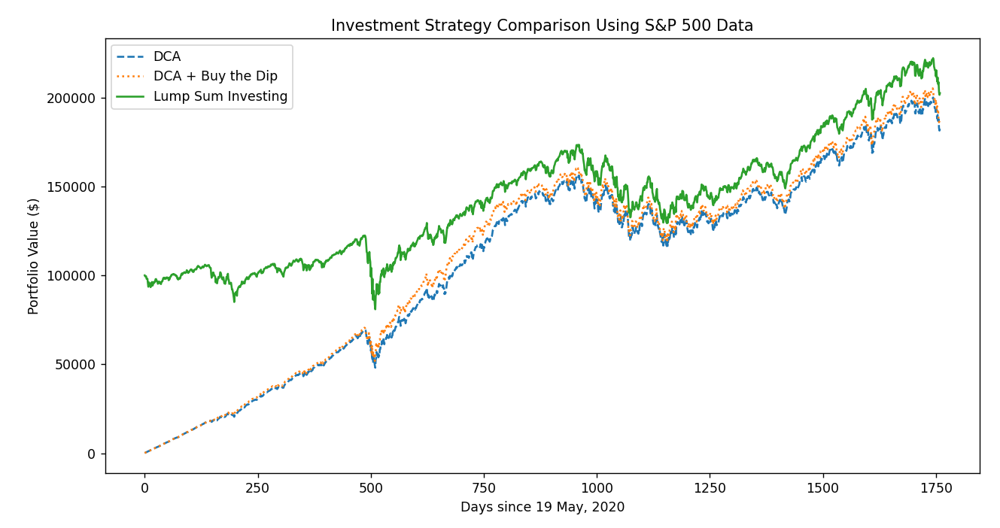

# Trading Strategy Tester

## Dollar Cost Averaging (dca.py)
### How to run (Unix)
```
python3 -m venv .venv
source .venv/bin/activate
pip install -r REQUIREMENTS.txt
python3 dca.py

```
### How to run (Windows PowerShell)
```
python -m venv .venv
.venv/scripts/Activate.ps1
pip install -r REQUIREMENTS.txt
python dca.py

```
### Sample Output
